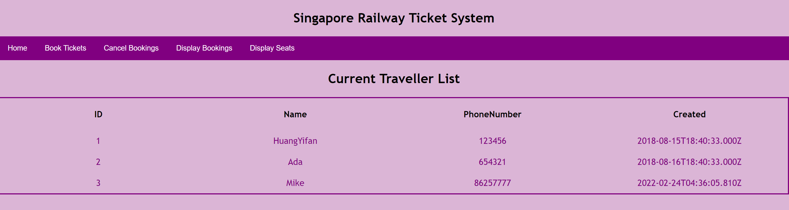

# Ticket System
This is the tutorial 4 submission for IT5007.  
### How to start?
Please use node **version >= 14** to compile. Make sure front-end and back-end are both running using the 2 commands below.
```
git clone https://github.com/yifanh1/ticket-system.git
cd ticket-system
```
- Front end(react): port 3000
```
nvm use 14
npm install
npm start
```
- Back end: Express and graphql: port 5000
```
node server/server.js
```
Note: if running in docker, you **don't** need to expose 5000.  
- MongoDB  
make sure you have MongoDB server running locally,  
then run  
```
mongo ticketsys scripts/init.mongo.js
```
to initialize database schema.

- Make sure both front-end and back-end is running before testing the webpage:  
  - Check the page: http://localhost:3000  
  - Check graphql(backend running on 5000): http://localhost:5000/graphql  

### Notice
- If you don't need to use graphql playground, no need to expose port 5000 since it's proxied by react (see package.json).

### Page style example
You should see a styling page like this (in display bookings page):  
I keep 2 sample records in server database, you can delete them if needed.  


### Standalone scripts to try MongoDB
The file is in folder scripts/try-mongo.js, use `node scripts/try-mongo.js` to run.
